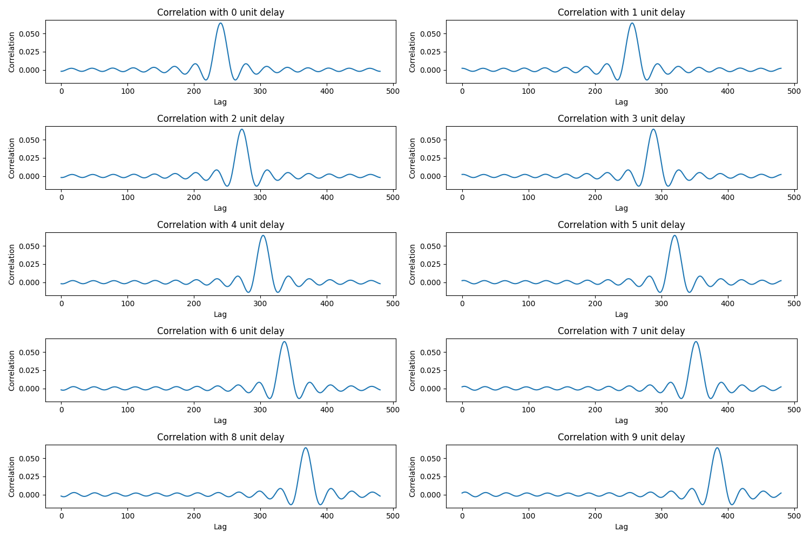

# GCC-PHATによる時間遅延推定

## 概要
このリポジトリは、GCC-PHAT（Generalized Cross-Correlation with Phase Transform）を用いて音声信号間の時間遅延を推定するPythonスクリプトを含んでいます。GCC-PHATは、特に反響や騒音が存在する環境でのロバスト性に優れており、音源の位置特定やマイクロフォンアレイを用いた音声信号処理に広く利用されています。

## GCC-PHATについて
GCC-PHATは、異なるマイクロフォンから得られる信号間の時間遅延を推定する手法です。このアルゴリズムは、相関関数の計算において位相情報のみを利用し、信号の時間差を正確に推定します。特に反響がある環境での定位を強化するために使用されますが、加算ノイズに対しては感度が高いとも知られています。

## スクリプトの概要
スクリプト `main.py` は、参照信号に対して異なる遅延を持つ信号を生成し、それぞれの信号に対してGCC-PHATを適用して時間遅延を推定します。相関配列は、各遅延に対するグラフとして可視化され、時間遅延の推定結果と共に出力されます。

## 相関グラフ


## 実行方法
Pythonスクリプトを実行するには、以下のコマンドを使用します。
```
python main.py
```
